```mermaid
%%{init: {'theme':'dark', 'themeVariables': { 'primaryColor': '#58A6FF', 'primaryTextColor': '#F5F5F5', 'primaryBorderColor': '#58A6FF', 'lineColor': '#58A6FF', 'secondaryColor': '#1A1A1A', 'tertiaryColor': '#0D0D0D'}}}%%
graph LR
    A[💼 OFM Business] --> B[🔍 Reverse Engineering]
    B --> C[💻 Development]
    C --> D[🛡️ Security]
    
    A -.-> E[TCN Agency 🚀]
    B -.-> F[Game Cheats 🎮]
    C -.-> G[Automation ⚡]
    
    style A fill:#58A6FF,stroke:#F5F5F5,stroke-width:2px,color:#0D0D0D
    style B fill:#2A2F4F,stroke:#58A6FF,stroke-width:2px,color:#F5F5F5
    style C fill:#1A1A1A,stroke:#58A6FF,stroke-width:2px,color:#F5F5F5
    style D fill:#0D0D0D,stroke:#58A6FF,stroke-width:2px,color:#F5F5F5
    style E fill:#58A6FF,stroke:#F5F5F5,stroke-width:1px,color:#0D0D0D
    style F fill:#2A2F4F,stroke:#58A6FF,stroke-width:1px,color:#F5F5F5
    style G fill:#1A1A1A,stroke:#58A6FF,stroke-width:1px,color:#F5F5F5
```

<div align="center">
  

# mosquito

**Founder @ TCN Agency**  
OFM → Reverse Engineering → Full Stack Dev

[](https://github.com/Mosquito1337)
[](https://t.me/visionVBV)
[](mailto:contact@tcnagency.fr)

<i>« Building systems that work »</i>
</div>

---

## 💼 **OnlyFans Management**

```js
// What I do now - OFM business
const OFM = {
  focus: "Creator monetization & growth",
  services: ["Account management", "Content strategy", "Fan engagement"],
  results: "Consistent revenue optimization",
  approach: "Data-driven + human psychology"
}
```

**Current work:**
- Managing multiple OF creators
- Building automated workflows for content & messaging
- Revenue optimization through A/B testing
- TCN Agency development & scaling

---

## 🔍 **Reverse Engineering** *(what I love)*

```cpp
// My main passion tbh
class ReverseEng {
public:
    vector<string> tools = {"IDA Pro", "Ghidra", "x64dbg", "CE"};
    string focus = "Game cheats & bypasses";
    bool still_active = true;
};
```

**Recent stuff:**
- Undetected cheats for popular FPS games
- VAC/EAC bypass research
- Memory hooking & DLL injection
- Custom driver dev when needed

---

## 💻 **Development**

```js
// Stack I actually use
const stack = {
  langs: ["C++", "JS", "Python", "Go", "lua"],
  web: ["React", "Node", "Mongo", "Tailwind", "Astro"],
  automation: ["n8n", "Puppeteer", "GPT API"],
  current_focus: "Building TCN Agency platform"
}
```

**Active projects:**
- TCN Agency (OFM platform)
- AutoFlows (workflow automation)
- Various tools & scrapers

---

## 🛡️ **Security & Pentest**

<details>
<summary>🛡️ Security stuff (less focus now)</summary>

```yaml
Web/Network:
- SQLi, XSS, basic pentest
- Burp Suite, SQLmap
- OSINT & recon when needed
```
</details>

---

## 💸 **Available for hire**

| 💼 OFM Services | 🔍 RE/Cheats | 💻 Dev Work |
|----------------|--------------|-------------|
| Creator management | Game cheats | Web apps |
| Revenue optimization | Bypass development | Automation tools |
| Platform setup | Analysis work | Custom solutions |

---

## 📊 **Current focus**

```
1. OFM Business (main income)
2. Reverse Engineering (passion project)
3. Development (supporting both)
4. Security (background knowledge)
```

---

## 📫 **Contact**

- **Telegram:** [@visionVBV](https://t.me/visionVBV)
- **Email:** [contact@tcnagency.fr](mailto:contact@tcnagency.fr)
- **TCN Agency:** https://linktr.ee/tcn.agency

<details>
  <summary>🔐 Session</summary>
  <code>05c30e4c934cd7ce9c6b1ef361983e4e4e89435bfaad8d14196441bcbecda9864e</code>
</details>

---

<div align="center">
  


  <br />
  
</div>
